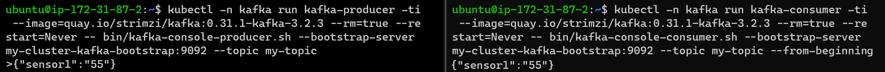

# Kubernetes Kafka Demo
- [Kubernetes Kafka Demo](#kubernetes-kafka-demo)
  - [Deploy a demo cluster](#deploy-a-demo-cluster)
  - [Deploy a kafka env based on k8s](#deploy-a-kafka-env-based-on-k8s)
    - [Basic Test of Kafka Cluster](#basic-test-of-kafka-cluster)
    - [Performance Tests](#performance-tests)
    - [Test 1: Single producer throughput using TLS.](#test-1-single-producer-throughput-using-tls)
    - [Test 2: Multiple producer throughput using TLS.](#test-2-multiple-producer-throughput-using-tls)
    - [Test 3: Single producer and consumer throughput.](#test-3-single-producer-and-consumer-throughput)
    - [Test 4: Multiple producer and single consumer throughput.](#test-4-multiple-producer-and-single-consumer-throughput)
    - [Test 5: End to End Latency.](#test-5-end-to-end-latency)

## Deploy a demo cluster

1. Install [kubectl](./documentation/kubectl.md)
2. Install [minikube](./documentation/minikube.md)

## Deploy a kafka env based on k8s

1. Create kafka namespace

    ```console
    kubectl create namespace kafka
    ```

2. Deploy Kafka cluster

    ```console
    kubectl create -f 'https://strimzi.io/install/latest?namespace=kafka' -n kafka
    ```

3. After that we feed Strimzi with a simple Custom Resource, which will then give you a small persistent Apache Kafka Cluster with one node each for Apache Zookeeper and Apache Kafka:

    ```console
    kubectl apply -f https://strimzi.io/examples/latest/kafka/kafka-persistent-single.yaml -n kafka
    ```

4. The above command might timeout if you’re downloading images over a slow connection. If that happens you can always run it again.

    ```console
    kubectl wait kafka/my-cluster --for=condition=Ready --timeout=300s -n kafka
    ```

### Basic Test of Kafka Cluster

1. Set a producer

    ```console
    kubectl -n kafka run kafka-producer -ti --image=quay.io/strimzi/kafka:0.31.1-kafka-3.2.3 --rm=true --restart=Never -- bin/kafka-console-producer.sh --bootstrap-server my-cluster-kafka-bootstrap:9092 --topic my-topic
    ```

2. Set a consumer

    ```console
    kubectl -n kafka run kafka-consumer -ti --image=quay.io/strimzi/kafka:0.31.1-kafka-3.2.3 --rm=true --restart=Never -- bin/kafka-console-consumer.sh --bootstrap-server my-cluster-kafka-bootstrap:9092 --topic my-topic --from-beginning
    ```

3. Send messages from *producer* to *consumer*:

    

### Performance Tests

It is possible to create multiple scenarios considering the variable load, message size, and the concurrent instances of the clients.There are five sets of scenarios relevant to the test:

- Single producer throughput.
- Multiple producer throughput.
- Single producer and consumer.
- Multiple producers and single consumer throughput
- End to End Latency.

1. Preparing env

    ```console
    KHOST=$(kubectl get svc -n kafka -o jsonpath="{.items[0].metadata.name}")
    KPORT=$(kubectl get svc -n kafka -o jsonpath="{.items[0].spec.ports[1].port}")
    export KAFKA=$KHOST:$KPORT
    ```

2. Create kafka-client

    ```console  
    kubectl apply -f kafka-client.yaml -n kafka
    ```

3. Create perf testing topic

    ```console
    kubectl exec -it kafka-client -n kafka -- kafka-topics --bootstrap-server $KAFKA --create --topic ssl-perf-test --partitions 6 --replication-factor 3 --config retention.ms=1800000 --config min.insync.replicas=2 --command-config /etc/kafka/config/client.properties
    ```

### Test 1: Single producer throughput using TLS.

1. Start producer

    ```console
    kubectl apply -f single-producer.yaml -n kafka
    ```

2. Collect infromation

    ```console
    $producer=$(kubectl get pods -n kafka --selector=job-name=kafka-single-producer-client --output=jsonpath='{.items[*].metadata.name}')
    ```

    ```console
    kubectl logs -f $producer -n kafka
    ```

### Test 2: Multiple producer throughput using TLS.

1. Start producer

    ```console
    kubectl apply -f multiple-producer.yaml -n kafka
    ```

2. Collect information

    ```console
    $producer=$(kubectl get pods -n kafka --selector=job-name=kafka-multiple-producer-client --output=jsonpath='{.items[*].metadata.name}')
    ```

    ```console
    kubectl logs -f $producer -n kafka
    ```

### Test 3: Single producer and consumer throughput.

1. Start consumer

    ```console
    kubectl apply -f consumer.yaml -n kafka
    ```

2. Start producer

    ```console
    kubectl apply -f producer-fixed-single.yaml -n kafka
    ```

3. Collect information of consumer

    ```console
    $consumer=$(kubectl get pods -n kafka --selector=job-name=kafka-consumer-client --output=jsonpath='{.items[*].metadata.name}')
    ```

    ```console
    kubectl logs -f $consumer -n kafka
    ```

4. Collect information of producer

    ```console
    $producer=$(kubectl get pods -n kafka --selector=job-name=kafka-producer-fixed-single --output=jsonpath='{.items[*].metadata.name}')
    ```

    ```console
    kubectl logs -f $producer -n kafka
    ```

### Test 4: Multiple producer and single consumer throughput.

1. Start consumer

    ```console
    kubectl apply -f consumer-fixed-single.yaml -n kafka
    ```

2. Start producer

    ```console
    kubectl apply -f producer-fixed-multiple.yaml -n kafka
    ```

3. Collect information of consumer

    ```console
    $consumer=$(kubectl get pods -n kafka --selector=job-name=kafka-consumer-fixed-single --output=jsonpath='{.items[*].metadata.name}')
    ```

    ```console
    kubectl logs -f $consumer -n kafka
    ```

4. Collect information of producers

    ```console
    $producers=$(kubectl get pods -n kafka --selector=job-name=kafka-producer-fixed-multiple --output=jsonpath='{.items[*].metadata.name}')
    ```

    ```console
    kubectl logs -f $producers -n kafka
    ```

### Test 5: End to End Latency.

1. Start consumer

    ```console
    kubectl apply -f e2e.yaml -n kafka
    ```

2. Collect information of latency

    ```console
    $e2e=$(kubectl get pods -n kafka --selector=job-name=kafka-e2e-client --output=jsonpath='{.items[*].metadata.name}')
    ```

    ```console
    kubectl logs -f $e2e -n kafka
    ```
